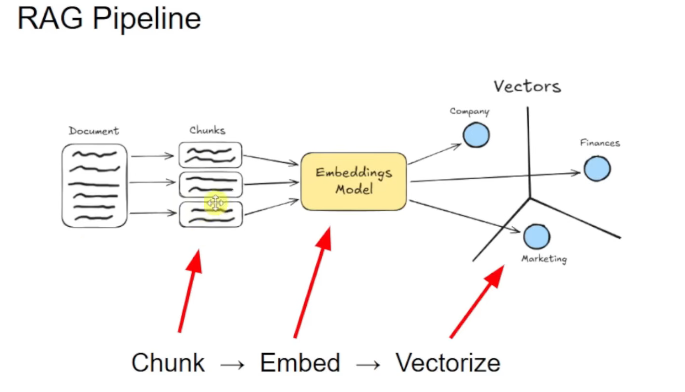
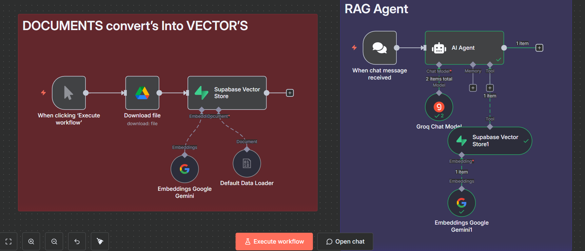
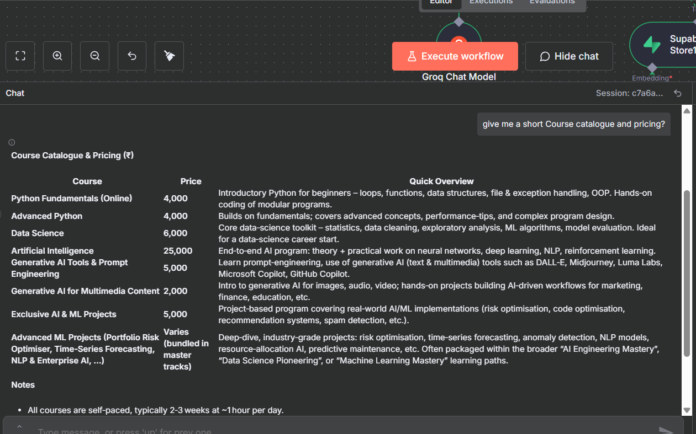

#  Agentic RAG + Supabase Vector DB
---
## GOAL
- **Ingestion:** Google Drive file → Default Data Loader (binary) → Gemini Embeddings (768-dim) → **Supabase Vector Store (insert)** → `documents` table.
- **Agentic RAG:** Chat Trigger → **AI Agent (Groq LLM)** + **Supabase Vector Store (retrieve-as-tool)** with Gemini embeddings → grounded answers from your vectors.
---

## AGENTIC RAG PIPELINE (Step-by-Step)
1. **User message** hits **Chat Trigger**.
2. **AI Agent (Groq)** interprets intent; if external knowledge is needed, it:
3. Creates **query embedding** (Gemini) → length **768** to match DB schema.
4. Calls **Supabase Vector Store (retrieve-as-tool)** → runs `match_documents(query_embedding, k, filter)` on table `documents`.
5. (Optional) **Re-rank**/filter the retrieved chunks.
6. **Compose final answer** grounded in retrieved context; (optionally) include references/metadata.
7. For ingestion jobs: **Manual Trigger → Google Drive (Download)** → **Default Data Loader (binary)** → **Gemini Embeddings** → **Supabase Vector Store (insert)** to keep the KB fresh.
---

## WORKFLOW CANVAS


# Workflow start
---

## 1) n8n Ingestion Flow — “DOCUMENTS convert’s Into VECTOR’S”
**Wiring:** `Manual Trigger → Google Drive (Download) → Supabase Vector Store [insert]`, with side inputs `Default Data Loader (binary)` and `Embeddings Google Gemini` going into the Supabase node.

### 1.1 Manual Trigger
- Node: **When clicking ‘Execute workflow’**

### 1.2 Google Drive (Download file)
- **Operation:** `Download`
- **File ID:** paste your Google Drive file ID
- **Credential:** your Google Drive OAuth2
- **Output:** 1 binary file (flows to Supabase node)

**Drag & Drop:** “+” → **Google Drive** → set Operation = Download → paste File ID → select credential.

### 1.3 Supabase Vector Store (Insert)
- **Mode / Operation:** `insert`
- **Table:** `documents`
- **Credentials:** your Supabase credential
- **Inputs:**
  - Main input from **Google Drive** (metadata and file reference)
  - **ai_document** from **Default Data Loader**
  - **ai_embedding** from **Embeddings Google Gemini**
- **Execute** the workflow to ingest vectors.

### 1.4 Default Data Loader
- **Data Type:** `binary`
- **Connect:** its **ai_document** output → Supabase Vector Store (left)

### 1.5 Embeddings Google Gemini
- **Model family:** Google Gemini Embeddings (`text-embedding-004`)
- **Connect:** **ai_embedding** → Supabase Vector Store (left)


> Ensure your embedding arrays are length **768**. If you switch models, update table/function and embeddings accordingly.

---
# Part B (RAG Agent)

---

## 2) n8n Retrieval Flow — “RAG Agent”
**Wiring:** `When chat message received → AI Agent`  
Agent receives:  
- **Language Model:** from **Groq Chat Model**  
- **Tool:** **Supabase Vector Store1** (mode: retrieve‑as‑tool)  
The vector store receives **ai_embedding** from **Embeddings Google Gemini1**.

### 2.1 Chat Trigger
- Node: **When chat message received** (creates a webhook)  
- Connect to **AI Agent**.

### 2.2 AI Agent
- Receives the Groq LLM and the Supabase tool.
- Optional system prompt:

```text
You are a helpful RAG agent. For each user query, build an embedding of the query and call the tool “Supabase Vector Store1” to retrieve the most relevant chunks. Write a concise answer grounded in the retrieved results.
```

**Test message:**  
```
Summarize the ingested document and list three key points.
```

### 2.3 Supabase Vector Store1 (Retrieve as Tool)
- **Mode:** `retrieve-as-tool`
- **Table:** `documents`
- **Tool Description:** “Get the Data from vector Database explore documents and response.”
- **Credentials:** your Supabase credential
- **Connect:** **ai_tool** → **AI Agent**.


### 2.4 Groq Chat Model
- **Model:** e.g., `openai/gpt-oss-120b`
- **Output:** connect **ai_languageModel** → **AI Agent**.

### 2.5 Embeddings Google Gemini1
- Same embedding provider as ingestion (Gemini)
- **Connect:** **ai_embedding** → **Supabase Vector Store1**.

---
## Testing

---


## 4) Troubleshooting
- **Dimension mismatch:** Table/function use `vector(768)` but your arrays differ → update both sides.
- **Supabase auth from n8n fails:** Re‑check Host and service_role key.
- **Drive download fails:** Confirm File ID and account permission.
- **Agent ignores tool:** Ensure **Supabase Vector Store1** is linked to **AI Agent → Tools** and Gemini1 is plugged into its **ai_embedding**.
- **Slow search:** Ensure the IVFFLAT index exists and run `ANALYZE documents;` after big uploads.

---

## 5) Model Dimensions Reference
- Google `text-embedding-004` → 768  
- OpenAI `text-embedding-3-small` → 1536  
- OpenAI `text-embedding-3-large` → 3072

If you change models, update SQL (`vector(N)`), the embeddings node, and any validation in Function nodes.

---

You now have a single README that covers Supabase setup and the full n8n canvas workflow (ingestion + RAG Agent).
