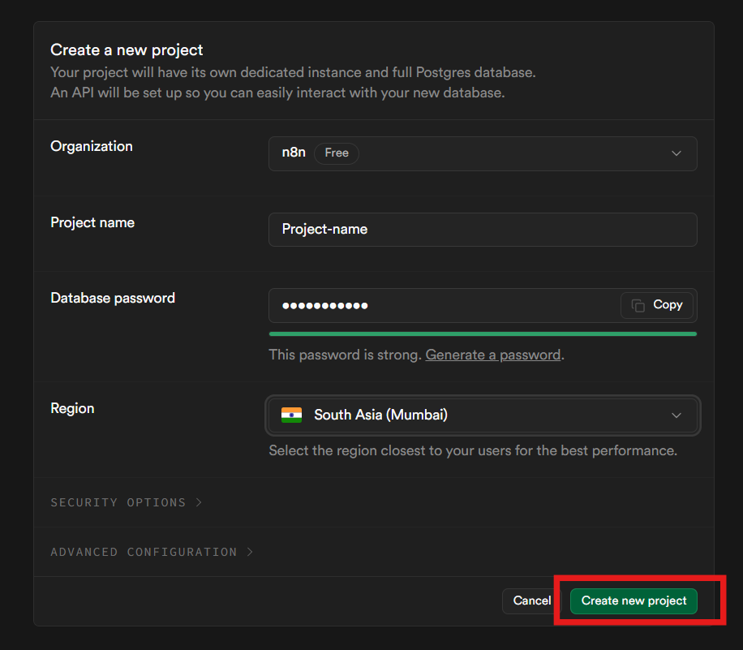
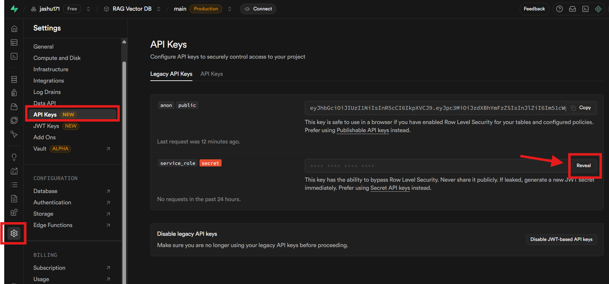
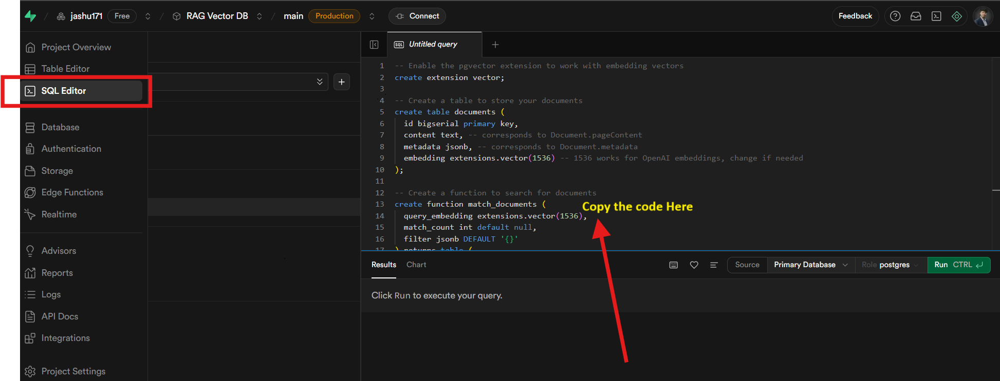
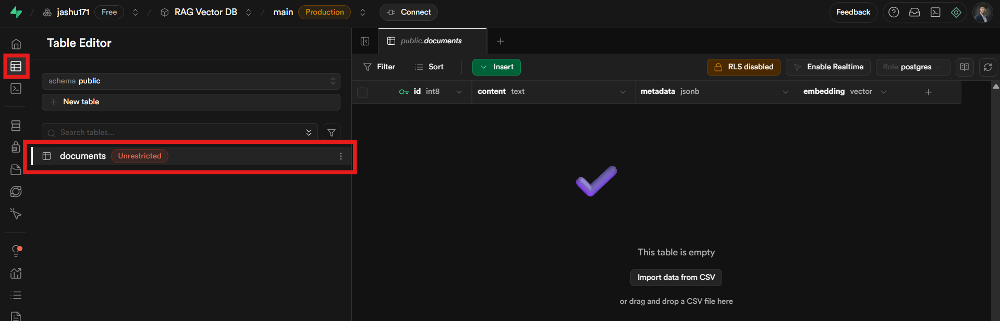
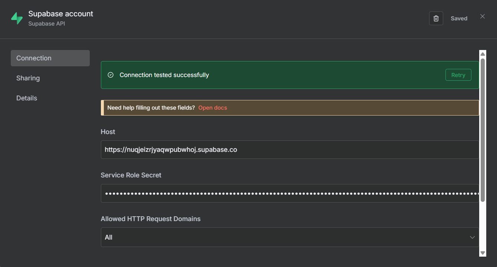

# Supabase Vector DB + n8n RAG Agent — Single README (Ultra‑Clear)

This guide merges two parts into one step‑by‑step document:
1) **Supabase setup** for a vector database with `pgvector`
2) **n8n workflow** (ingestion + retrieval RAG Agent) exactly like the canvas

---

## 1) GOAL
- Create a production‑ready **vector table** on Supabase and expose a search function.
- In n8n:
  - **Ingestion:** Take a Google Drive file → chunk/load → embed with **Google Gemini** → insert into Supabase.
  - **RAG Agent:** Chat trigger → **AI Agent (Groq)** retrieves from Supabase via **Supabase Vector Store** tool and answers.

Canvas reference:  


---

## 2) PREREQUISITES — Supabase Vector Store + n8n
- Supabase account: https://supabase.com/
- n8n instance (Cloud or self‑hosted)
- API Keys / Credentials:
  - **Supabase:** Project URL (Host) + **service_role** secret
  - **Google Drive OAuth2:** permission to download the source file
  - **Google Gemini API key:** for embeddings (768‑dim)
  - **Groq API key:** for the chat model used by the Agent
- Decide the **embedding model** and its **dimension**. This README uses Google `text-embedding-004` → **768** dims. If you change models, update the SQL `vector(N)` and your embedding arrays to match.

---

## 3) Create a new Supabase project
1. Open https://supabase.com/ and sign in.
2. Click **Create new project**, enter project name, set a strong password, choose a region, then **Create new project**.  
   

---

## 4) Get the Project Host (Data API URL)
1. Go to **Project Settings → Data API**.
2. Copy the **URL** (looks like `https://xxxxxx.supabase.co`). Use this as **Host** in n8n.  
   

---

## 5) Get the Service Role Secret
1. Go to **Project Settings → API Keys**.
2. Under **service_role (secret)** click **Reveal** and copy it. Keep it server‑side only.  
   

---

## 6) Create the Vector Table and Search Function
1. Open **SQL Editor** in Supabase.
2. Paste the SQL below and click **Run**.  
   

```sql
-- 1) Install pgvector
create extension if not exists vector;

-- 2) Table (768 dims)
create table if not exists documents (
  id bigserial primary key,
  content  text,
  metadata jsonb,
  embedding vector(768) not null
);

-- 3) ANN index (choose one)
-- IVFFLAT (works everywhere with pgvector)
create index if not exists documents_embedding_ivfflat
  on documents using ivfflat (embedding vector_cosine_ops) with (lists = 100);

-- HNSW (pgvector >= 0.5.0; if supported)
-- create index if not exists documents_embedding_hnsw
--   on documents using hnsw (embedding vector_cosine_ops) with (m=16, ef_construction=64);

-- 4) Search function (cosine distance -> similarity)
create or replace function match_documents (
  query_embedding vector(768),
  match_count int default null,
  filter jsonb default '{}'
) returns table (
  id bigint,
  content text,
  metadata jsonb,
  similarity float
)
language sql
as $$
  select
    id,
    content,
    metadata,
    1 - (embedding <=> query_embedding) as similarity
  from documents
  where metadata @> filter
  order by embedding <=> query_embedding
  limit match_count
$$;
```

If it succeeds, you should see a success message.  


---

## 7) Verify the table
Open **Table Editor** and confirm that `documents` exists with columns `id`, `content`, `metadata`, `embedding`.  


> Production tip: keep RLS enabled and design policies for anon/public roles. Use the service role only on trusted servers like n8n.

---

## 8) Add Supabase credentials in n8n
1. In n8n, go to **Credentials → New → Supabase account**.
2. Fill in:
   - **Host:** paste Project URL from Step 4
   - **Service Role Secret:** paste key from Step 5
   - **Allowed HTTP Request Domains:** All (or restrict)
3. Click **Test** → should show **Connection tested successfully** → **Save**.  
   

---

## 9) n8n Ingestion Flow — “DOCUMENTS convert’s Into VECTOR’S”
**Wiring:** `Manual Trigger → Google Drive (Download) → Supabase Vector Store [insert]`, with side inputs `Default Data Loader (binary)` and `Embeddings Google Gemini` going into the Supabase node.

### 9.1 Manual Trigger
- Node: **When clicking ‘Execute workflow’**

### 9.2 Google Drive (Download file)
- **Operation:** `Download`
- **File ID:** paste your Google Drive file ID
- **Credential:** your Google Drive OAuth2
- **Output:** 1 binary file (flows to Supabase node)

**Drag & Drop:** “+” → **Google Drive** → set Operation = Download → paste File ID → select credential.

### 9.3 Default Data Loader
- **Data Type:** `binary`
- **Connect:** its **ai_document** output → Supabase Vector Store (left)

### 9.4 Embeddings Google Gemini
- **Model family:** Google Gemini Embeddings (`text-embedding-004`)
- **Connect:** **ai_embedding** → Supabase Vector Store (left)

### 9.5 Supabase Vector Store (Insert)
- **Mode / Operation:** `insert`
- **Table:** `documents`
- **Credentials:** your Supabase credential
- **Inputs:**
  - Main input from **Google Drive** (metadata and file reference)
  - **ai_document** from **Default Data Loader**
  - **ai_embedding** from **Embeddings Google Gemini**
- **Execute** the workflow to ingest vectors.

> Ensure your embedding arrays are length **768**. If you switch models, update table/function and embeddings accordingly.

---

## 10) n8n Retrieval Flow — “RAG Agent”
**Wiring:** `When chat message received → AI Agent`  
Agent receives:  
- **Language Model:** from **Groq Chat Model**  
- **Tool:** **Supabase Vector Store1** (mode: retrieve‑as‑tool)  
The vector store receives **ai_embedding** from **Embeddings Google Gemini1**.

### 10.1 Chat Trigger
- Node: **When chat message received** (creates a webhook)  
- Connect to **AI Agent**.

### 10.2 Groq Chat Model
- **Model:** e.g., `openai/gpt-oss-120b`
- **Output:** connect **ai_languageModel** → **AI Agent**.

### 10.3 Embeddings Google Gemini1
- Same embedding provider as ingestion (Gemini)
- **Connect:** **ai_embedding** → **Supabase Vector Store1**.

### 10.4 Supabase Vector Store1 (Retrieve as Tool)
- **Mode:** `retrieve-as-tool`
- **Table:** `documents`
- **Tool Description:** “Get the Data from vector Database explore documents and response.”
- **Credentials:** your Supabase credential
- **Connect:** **ai_tool** → **AI Agent**.

### 10.5 AI Agent
- Receives the Groq LLM and the Supabase tool.
- Optional system prompt:

```text
You are a helpful RAG agent. For each user query, build an embedding of the query and call the tool “Supabase Vector Store1” to retrieve the most relevant chunks. Write a concise answer grounded in the retrieved results.
```

**Test message:**  
```
Summarize the ingested document and list three key points.
```

---

## 11) Optional function node snippets

### 11.1 Build a single item for insert
```javascript
// Assumes upstream nodes provide text, metadata, and embedding (array of length 768)
return [{
  json: {
    content: $json.text,
    metadata: $json.metadata || { source: "n8n", tag: "demo" },
    embedding: $json.embedding
  }
}];
```

### 11.2 Minimal filter on query
```json
{}
```
Or restrict by tag:
```json
{ "tag": "demo" }
```

---

## 12) Troubleshooting
- **Dimension mismatch:** Table/function use `vector(768)` but your arrays differ → update both sides.
- **Supabase auth from n8n fails:** Re‑check Host and service_role key.
- **Drive download fails:** Confirm File ID and account permission.
- **Agent ignores tool:** Ensure **Supabase Vector Store1** is linked to **AI Agent → Tools** and Gemini1 is plugged into its **ai_embedding**.
- **Slow search:** Ensure the IVFFLAT index exists and run `ANALYZE documents;` after big uploads.

---

## 13) Model Dimensions Reference
- Google `text-embedding-004` → 768  
- OpenAI `text-embedding-3-small` → 1536  
- OpenAI `text-embedding-3-large` → 3072

If you change models, update SQL (`vector(N)`), the embeddings node, and any validation in Function nodes.

---

You now have a single README that covers Supabase setup and the full n8n canvas workflow (ingestion + RAG Agent).
