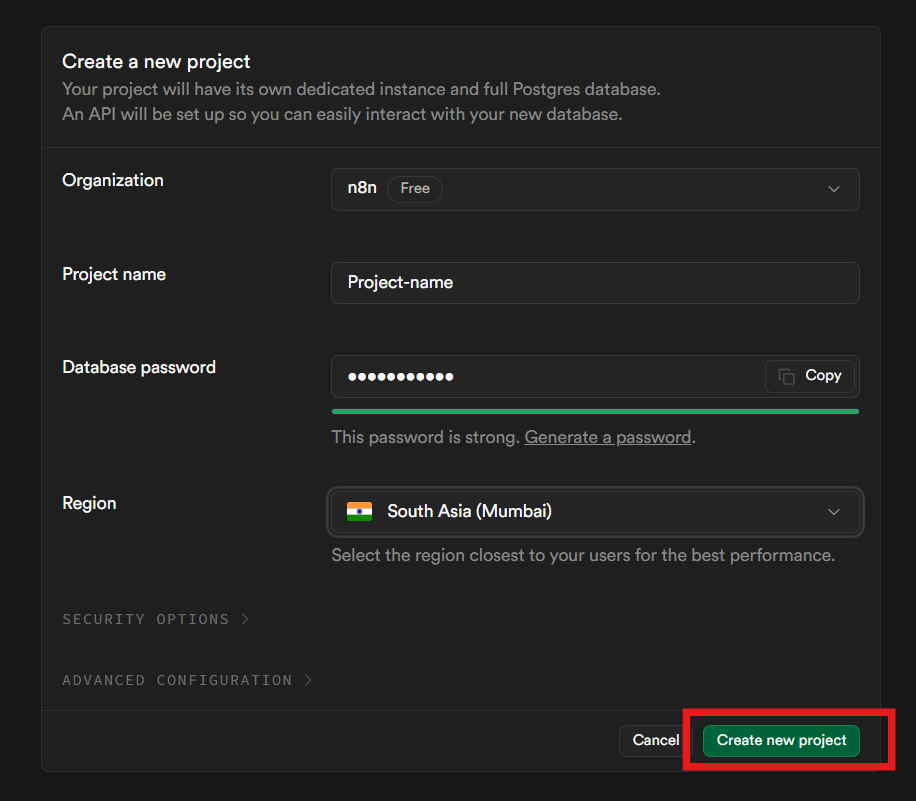
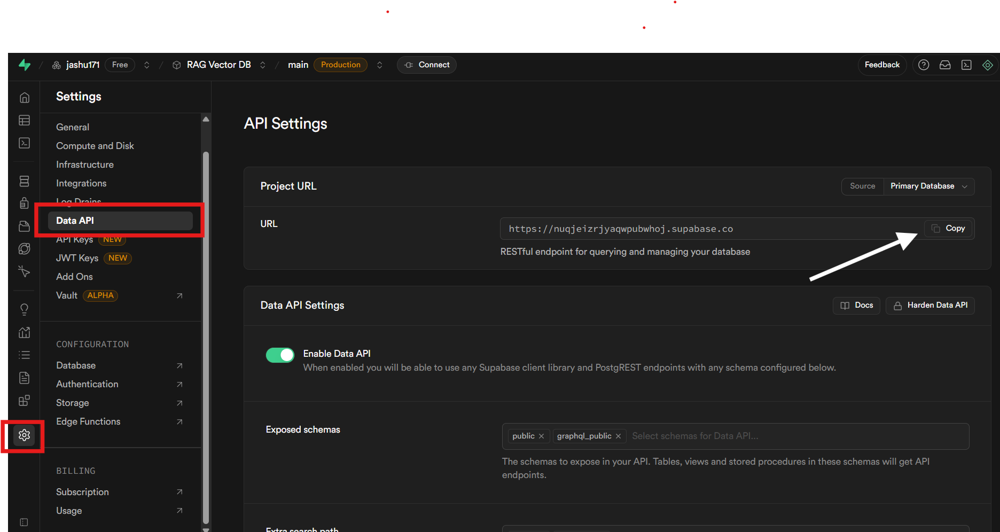
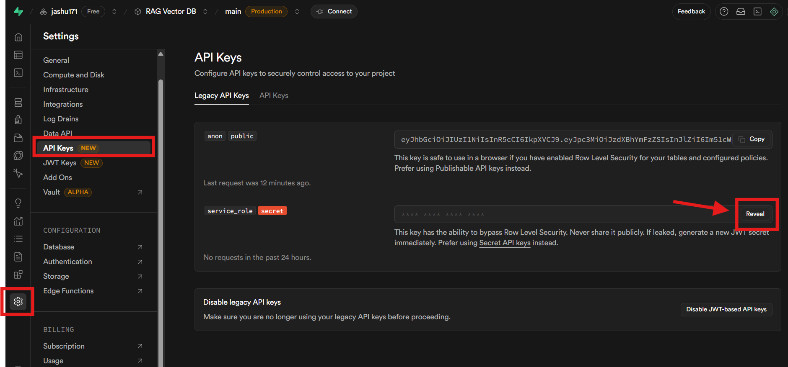
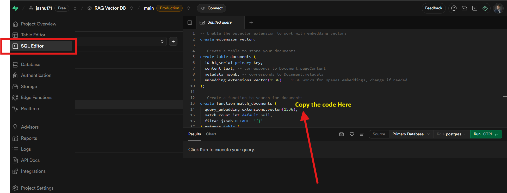
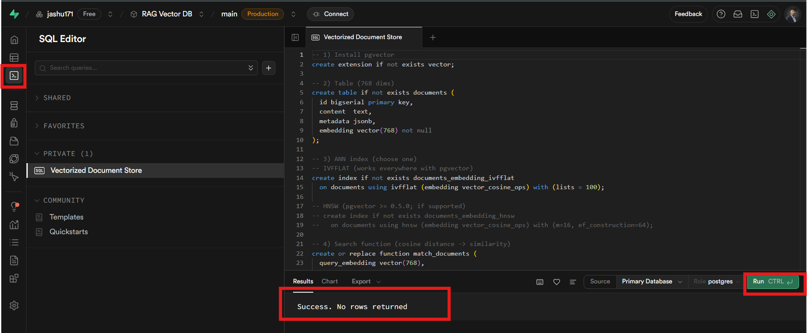
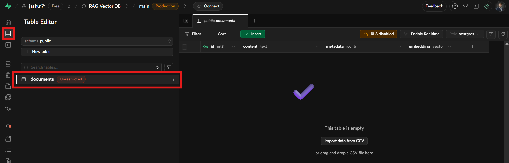
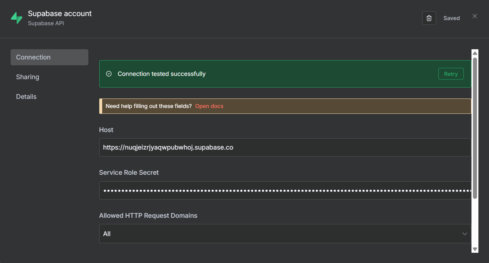

# Supabase Vector DB + n8n - steup 

This shows you **exactly** how to create a Supabase Vector Database and wire it to **n8n’s Supabase Vector Store** node. 

---

## 1) GOAL
Create a production‑ready **vector table** on Supabase (Postgres + `pgvector`), then connect it to **n8n** so you can **insert embeddings** and **search** with cosine similarity.

---

## 2) PREREQUISITES — *Supabase Vector Store + N8N setup*

- A Supabase account: <https://supabase.com/>
- An n8n instance (Cloud or self‑hosted) with access to the Internet.
- **Embedding model choice** (so you know the vector **dimensions**):
  - Google `text-embedding-004` → **768** dims
  - OpenAI `text-embedding-3-small` → **1536** dims
  - OpenAI `text-embedding-3-large` → **3072** dims  
  *(Use the correct dimension in your SQL; this guide uses **768**.)*
- You’ll use the **Service Role Secret** for server‑side writes from n8n. **Never expose it in front‑end code.**

---

## 3) Create a Supabase project

1. Open <https://supabase.com/> and **Sign in**.
2. Click **Create new project**. Choose a **Project name**, set a **strong password**, and pick a **region** closest to your users.  
   

---

## 4) Get your **Project API URL** (Host)

1. In the left sidebar, go to **Project Settings → Data API**.
2. Copy the **URL** (Project URL). You’ll paste this into n8n as the **Host**.  
   

> Tip: The URL looks like `https://xxxxxx.supabase.co`

---

## 5) Get your **Service Role Secret**

1. Go to **Project Settings → API Keys**.
2. Under **Legacy API Keys** or **API Keys**, click **Reveal** for **service_role (secret)** and **copy** it.  
   

> ⚠️ Security: Treat this key like a password. Use it only on trusted servers (like n8n), not in browsers or public repos.

---

## 6) Create the **Vector table** (SQL)

1. Open **SQL Editor** in Supabase.
2. Paste the following and **Run**:

```sql
-- 1) Install pgvector
create extension if not exists vector;

-- 2) Table (768 dims)
create table if not exists documents (
  id bigserial primary key,
  content  text,
  metadata jsonb,
  embedding vector(768) not null
);

-- 3) ANN index (choose one)
-- IVFFLAT (works everywhere with pgvector)
create index if not exists documents_embedding_ivfflat
  on documents using ivfflat (embedding vector_cosine_ops) with (lists = 100);

-- HNSW (pgvector >= 0.5.0; if supported)
-- create index if not exists documents_embedding_hnsw
--   on documents using hnsw (embedding vector_cosine_ops) with (m=16, ef_construction=64);

-- 4) Search function (cosine distance -> similarity)
create or replace function match_documents (
  query_embedding vector(768),
  match_count int default null,
  filter jsonb default '{}'
) returns table (
  id bigint,
  content text,
  metadata jsonb,
  similarity float
)
language sql
as $$
  select
    id,
    content,
    metadata,
    1 - (embedding <=> query_embedding) as similarity
  from documents
  where metadata @> filter
  order by embedding <=> query_embedding
  limit match_count
$$;
```

> Paste the code in the editor shown like this:  


If it succeeds, you’ll see a message similar to **“Success. No rows returned.”**  


---

## 7) Verify the **documents** table exists

Open **Table Editor** and confirm you can see **`documents`** with columns `id`, `content`, `metadata`, `embedding`.  


> If you see a badge like **Unrestricted**, that’s just the quick status in the UI. For production, review **RLS** policies.

---

## 8) Connect **n8n** to Supabase

1. In n8n, open **Credentials → New → Supabase account**.
2. Fill:
   - **Host**: Paste the **Project URL** from Step 4 (e.g., `https://xxxxxx.supabase.co`)
   - **Service Role Secret**: Paste the key from Step 5
   - **Allowed HTTP Request Domains**: `All` (or restrict to your use case)
3. Click **Test** → **Connection tested successfully** → **Save**.  
   

---

## 10) Troubleshooting Quick Notes (optional)

- **Dimension mismatch** → Recreate table/function with the correct `vector(N)` size.
- **Connection failed in n8n** → Recheck Host URL and Service Role Secret.
- **Slow queries** → Ensure the IVFFLAT index exists and run `ANALYZE documents;` after big ingests.
- **Security** → Keep RLS enabled with policies for anon/public access. Use **service_role** only on the server (n8n).
- What changed if you pick a different embedding model?

Only the **vector dimension** in SQL and the **length of your arrays** in n8n:
- OpenAI `text-embedding-3-small` → change `vector(768)` to `vector(1536)`
- OpenAI `text-embedding-3-large` → `vector(3072)`

Update both the **table** and the **function** signatures consistently.

---

### You’re done!
You now have a Supabase Vector DB wired to n8n’s Supabase Vector Store. Ingest embeddings, then run semantic search directly from your workflows.
